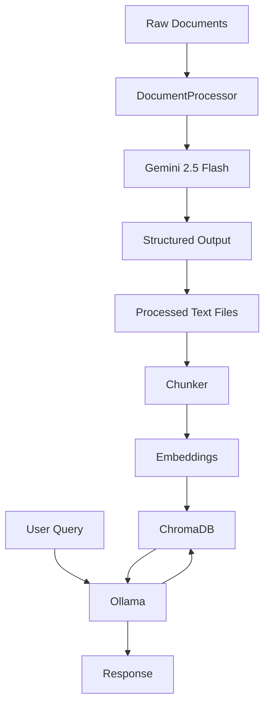

<div align="center">

<pre>
 █████╗ ███╗   ███╗██╗   ██╗      ██████╗  █████╗  ██████╗ 
██╔══██╗████╗ ████║██║   ██║      ██╔══██╗██╔══██╗██╔════╝ 
███████║██╔████╔██║██║   ██║█████╗██████╔╝███████║██║  ███╗
██╔══██║██║╚██╔╝██║██║   ██║╚════╝██╔══██╗██╔══██║██║   ██║
██║  ██║██║ ╚═╝ ██║╚██████╔╝      ██║  ██║██║  ██║╚██████╔╝
╚═╝  ╚═╝╚═╝     ╚═╝ ╚═════╝       ╚═╝  ╚═╝╚═╝  ╚═╝ ╚═════╝ 
</pre>

### **Context-Aware RAG Assistant for Aligarh Muslim University**

*Multi-Modal Ingestion · Local-First RAG · Structured Document Understanding*

---

[](https://www.python.org/)
[](https://fastapi.tiangolo.com/)
[](https://www.trychroma.com/)
[](https://ollama.ai/)
[](https://huggingface.co/docs/transformers/)
[](https://pytorch.org/)
[](https://python.langchain.com/)
[-4285F4?style=for-the-badge\&logo=google\&logoColor=white)](https://deepmind.google/technologies/gemini/)
[](https://streamlit.io/)
[](LICENSE)


</div>

---

## 📌 What is AMU-RAG?

**AMU-RAG** is a modular Retrieval-Augmented Generation (RAG) system designed for institutional knowledge at **Aligarh Muslim University**.

It focuses on transforming **raw, messy documents** (PDFs, images, notices) into:

* structured metadata
* clean summaries
* retrieval-ready text

…and enabling **accurate, local-first question answering** over that data.

> **Design Principle:**
> Gemini is used once during ingestion. All querying and reasoning happens locally via Ollama.

---

## ✨ Core Capabilities

| Capability                 | Description                                          |
| -------------------------- | ---------------------------------------------------- |
| 🖼️ Multi-Modal Processing | Handles `.txt`, `.md`, `.pdf`, `.jpg`, `.png`        |
| 🧠 Structured Extraction   | Converts documents → metadata + normalized summaries |
| 🔍 Semantic Retrieval      | ChromaDB + embeddings for similarity search          |
| 🧩 Modular Design          | Clear separation: ingestion → processing → retrieval |
| 🔒 Local-First Querying    | No external calls during inference                   |
| ⚙️ Config-Driven           | Environment-based configuration                      |

---

## 🏗️ System Overview



---

## 📂 Project Structure

```
amu-rag/
│
├── src/amu_rag/
│   ├── config.py
│   │
│   ├── clients/
│   │   ├── gemini_client.py
│   │   └── ollama_client.py
│   │
│   ├── processing/
│   │   ├── document_processor.py
│   │   └── response_parser.py
│   │
│   ├── ingestion/
│   │   └── chunker.py
│   │
│   └── prompts/
│       ├── text_prompt.txt
│       └── image_prompt.txt
│
├── data/
│   ├── raw/
│   └── processed/
│
├── requirements.txt
└── README.md
```

---

## 🔄 Document Processing

Each document goes through:

1. **Type Detection**
2. **Conversion (if needed)**

   * PDFs → images (`pdf2image`)
3. **LLM Extraction (Gemini)**
4. **Structured Parsing**
5. **Saved Output**

### Output Format

```txt
---METADATA---
{ ... }

---SUMMARY---
Clean natural language summary
```

---

## 🧩 Metadata Schema

```json
{
  "doc_type": "notice",
  "issue_date": "YYYY-MM-DD",
  "effective_date": null,
  "deadline": null,
  "expires": false,
  "target_audience": ["students"]
}
```

---

## ⚙️ Configuration

```bash
cp .env.example .env
```

| Variable        | Description                      |
| --------------- | -------------------------------- |
| GEMINI_API_KEY  | Required for document processing |
| GEMINI_MODEL    | Default: gemini-2.5-flash        |
| OLLAMA_MODEL    | Default: llama3.2                |
| OLLAMA_BASE_URL | Local Ollama endpoint            |

---

## 🚀 Getting Started

### 1. Setup

```bash
git clone https://github.com/rahman-misbah/amu-rag.git
cd amu-rag

python -m venv .venv
source .venv/bin/activate

pip install -r requirements.txt
```

### 2. Start Ollama

```bash
ollama pull llama3.2
```

### 3. Configure

```bash
cp .env.example .env
```

Add your Gemini API key.

---

### 4. Process Documents

```python
from src.amu_rag.processing.document_processor import DocumentProcessor

DocumentProcessor.process("notice.pdf")
```

---

## 🧠 Chunking Strategy

* Chunk size: **800 characters**
* Overlap: **160 characters**
* Word-boundary aware

This preserves semantic continuity for embeddings.

---

## 🤖 Model Roles

| Model              | Role                        |
| ------------------ | --------------------------- |
| Gemini 2.5 Flash   | Extraction + structuring    |
| Llama 3.2 (Ollama) | Local reasoning + answering |

---

## 📊 Current Scope

✅ Implemented:

* Document ingestion (multi-modal)
* Structured extraction pipeline
* Chunking system

🚧 In Progress:

* Full RAG query pipeline
* API layer
* Ranking improvements

---

## 🤝 Contributing

```
feat/<name>
fix/<bug>
refactor/<scope>
docs/<update>
```

Standard GitHub flow:

* Fork
* Branch
* PR

---

## 📜 License

MIT License

---

<div align="center">

Built for Aligarh Muslim University

</div>
