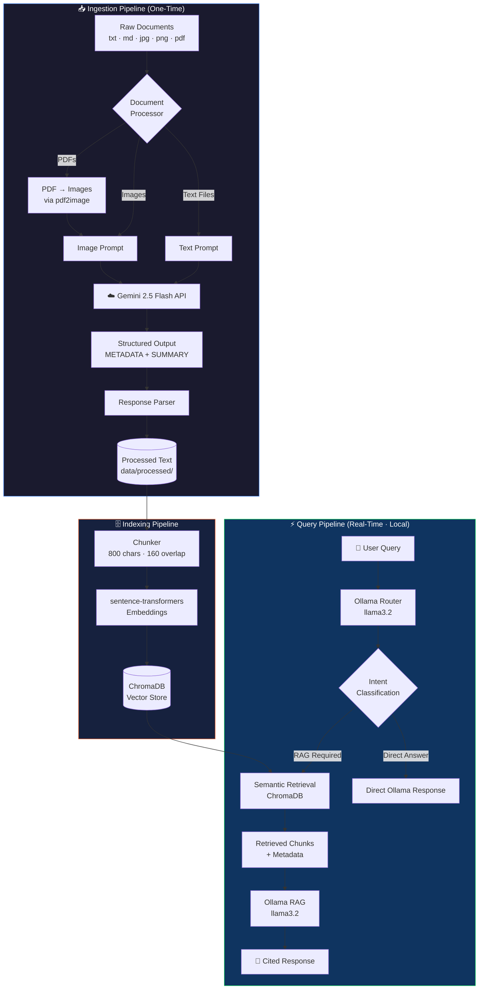
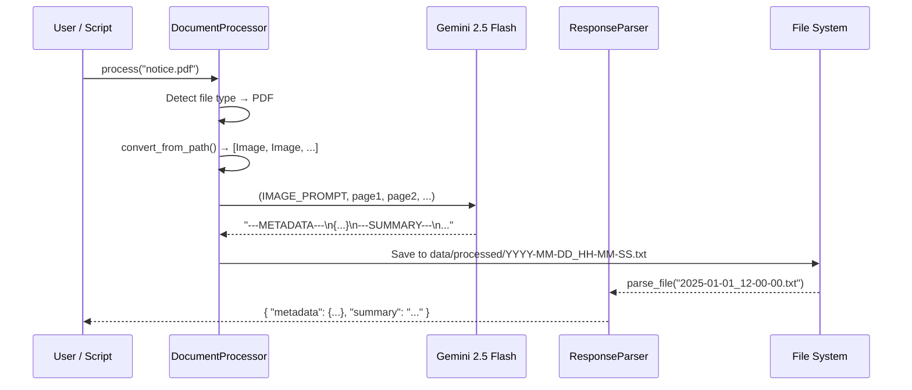
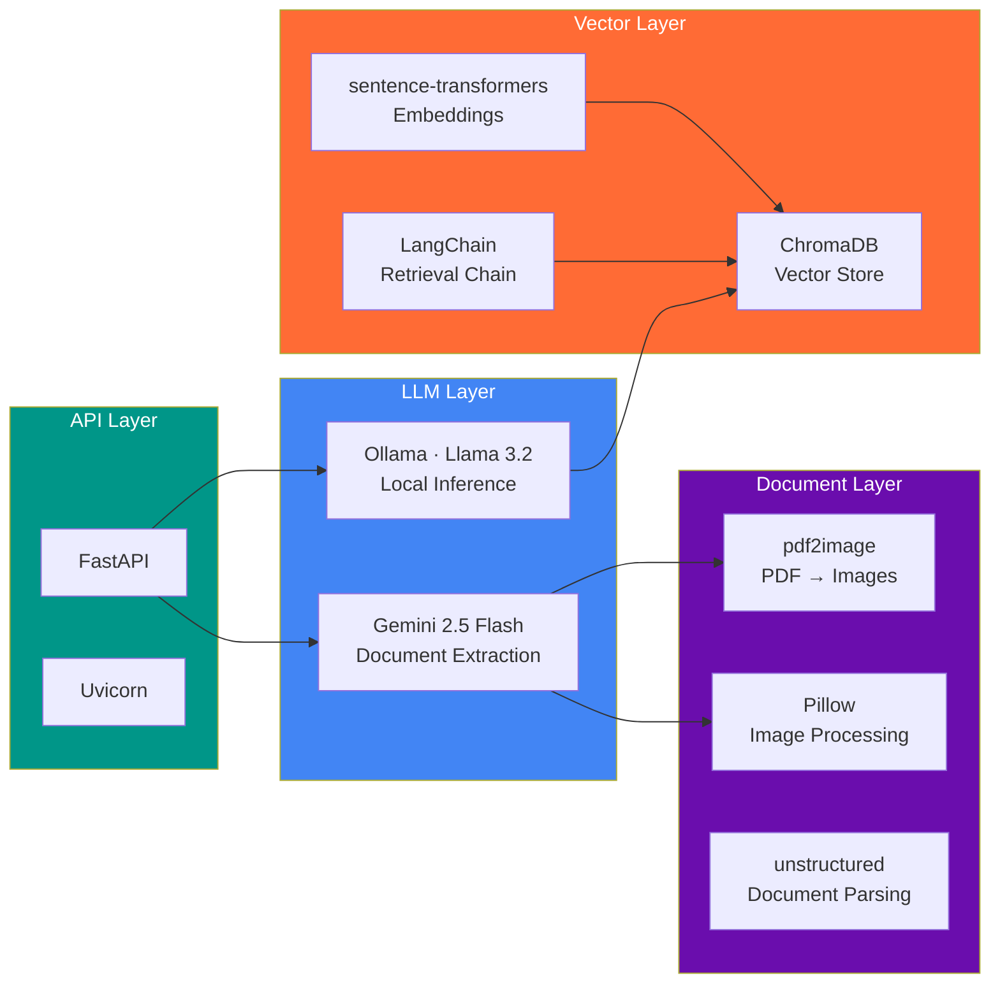

<div align="center">

```
 █████╗ ███╗   ███╗██╗   ██╗      ██████╗  █████╗  ██████╗ 
██╔══██╗████╗ ████║██║   ██║      ██╔══██╗██╔══██╗██╔════╝ 
███████║██╔████╔██║██║   ██║█████╗██████╔╝███████║██║  ███╗
██╔══██║██║╚██╔╝██║██║   ██║╚════╝██╔══██╗██╔══██║██║   ██║
██║  ██║██║ ╚═╝ ██║╚██████╔╝      ██║  ██║██║  ██║╚██████╔╝
╚═╝  ╚═╝╚═╝     ╚═╝ ╚═════╝       ╚═╝  ╚═╝╚═╝  ╚═╝ ╚═════╝ 
```

### **Context-Aware RAG Assistant for Aligarh Muslim University**
*Retrieval-Augmented Generation · Multi-Modal · Privacy-First · Sub-5s Responses*

---

[](https://www.python.org/)
[](https://fastapi.tiangolo.com/)
[](https://www.trychroma.com/)
[](https://ollama.ai/)
[](https://deepmind.google/technologies/gemini/)
[](https://www.langchain.com/)
[](LICENSE)
[](CONTRIBUTING.md)

</div>

---

## 📌 What is AMU-RAG?

**AMU-RAG** is a production-grade, privacy-first conversational AI system built specifically for [Aligarh Muslim University](https://www.amu.ac.in/). It ingests multi-modal institutional documents — notices, circulars, policies, event announcements, and scanned images — and lets users query them in natural language, receiving cited, accurate responses in **under 5 seconds**.

> **Key Philosophy:** All inference runs locally via Ollama. Gemini is used *only* for one-time document processing at ingestion time. Your data never leaves your infrastructure at query time.

---

## ✨ Features

| Feature | Description |
|---|---|
| 🖼️ **Multi-Modal Ingestion** | Processes `.txt`, `.md`, `.jpg`, `.png`, `.pdf` documents out of the box |
| 🧠 **Dual-LLM Architecture** | Gemini 2.5 Flash for document extraction · Llama 3.2 for local RAG inference |
| 🔍 **Semantic Search** | ChromaDB + sentence-transformers for dense vector retrieval |
| 📄 **Structured Extraction** | Every document yields typed metadata (dates, audience, doc_type) + a clean prose summary |
| ⚡ **Sub-5s Latency** | Optimised chunking, local embeddings, and tuned Ollama inference configs |
| 🔒 **Data Privacy** | Zero query-time data exfiltration — all RAG inference is fully local |
| 🌐 **REST API** | FastAPI backend with automatic OpenAPI docs at `/docs` |
| 🧩 **LangChain Integration** | Full LangChain + LangChain-Chroma pipeline for retrieval chains |

---

## 🏗️ System Architecture



---

## 📂 Project Structure

```
amu-rag/
│
├── 📁 src/amu_rag/                  # Core application package
│   ├── __init__.py                  # Public API surface
│   ├── config.py                    # Env-driven configuration
│   │
│   ├── 📁 clients/                  # LLM client abstractions
│   │   ├── __init__.py
│   │   ├── gemini_client.py         # Google Gemini 2.5 Flash
│   │   └── ollama_client.py         # Local Llama 3.2 via Ollama
│   │
│   ├── 📁 processing/               # Document & response handling
│   │   ├── __init__.py
│   │   ├── document_processor.py    # Multi-modal ingestion logic
│   │   └── response_parser.py       # Structured output parser
│   │
│   ├── 📁 ingestion/                # Chunking pipeline
│   │   ├── __init__.py
│   │   └── chunker.py               # Word-boundary-aware chunker
│   │
│   └── 📁 prompts/                  # Prompt templates
│       ├── __init__.py              # Prompt loader
│       ├── text_prompt.txt          # RAG-ready text extraction prompt
│       └── image_prompt.txt         # OCR + extraction prompt
│
├── 📁 data/
│   ├── 📁 raw/
│   │   ├── text/                    # .txt and .md source files
│   │   ├── image/                   # .jpg / .png source files
│   │   └── pdf/                     # .pdf source files
│   └── 📁 processed/                # Gemini-extracted structured text
│
├── .env.example                     # Environment variable template
├── .gitignore
├── requirements.txt
└── README.md
```

---

## 🔄 Document Processing Pipeline



---

## 🧩 Metadata Schema

Every processed document produces a typed metadata object alongside its prose summary:

```jsonc
// ---METADATA---
{
  "expires": true,                          // time-sensitive flag
  "doc_type": "notice",                     // notice | policy | circular | event | background | announcement
  "issue_date": "2024-11-15",               // YYYY-MM-DD or null
  "effective_date": "2024-11-20",           // YYYY-MM-DD or null
  "deadline": "2024-12-01",                 // YYYY-MM-DD or null
  "target_audience": ["students", "faculty"] // students | faculty | staff | public | administration
}

// ---SUMMARY---
// Detailed plain-text prose summary, translated to English if source is in Hindi/Urdu.
// All tables, lists, and structured data converted to flowing paragraphs.
```

---

## ⚙️ Configuration

All configuration is environment-driven via `.env`. Copy `.env.example` to get started:

```bash
cp .env.example .env
```

| Variable | Default | Description |
|---|---|---|
| `GEMINI_API_KEY` | **required** | Your Google Gemini API key |
| `GEMINI_MODEL` | `gemini-2.5-flash` | Gemini model identifier |
| `GEMINI_TEMPERATURE` | `0.1` | Generation temperature (low = factual) |
| `GEMINI_MAX_TOKENS` | `8192` | Max output tokens per Gemini call |
| `OLLAMA_BASE_URL` | `http://localhost:11434` | Ollama server endpoint |
| `OLLAMA_MODEL` | `llama3.2` | Local model for routing + RAG |

---

## 🚀 Getting Started

### Prerequisites

- Python 3.10+
- [Ollama](https://ollama.ai/) installed and running locally
- A Google Gemini API key ([get one free](https://aistudio.google.com/app/apikey))
- `poppler` (for PDF processing): `brew install poppler` / `apt install poppler-utils`

### 1 · Clone & Install

```bash
git clone https://github.com/rahman-misbah/amu-rag.git
cd amu-rag

python -m venv .venv
source .venv/bin/activate       # Windows: .venv\Scripts\activate

pip install -r requirements.txt
```

### 2 · Pull the Local Model

```bash
ollama pull llama3.2
```

### 3 · Configure Environment

```bash
cp .env.example .env
# Edit .env and add your GEMINI_API_KEY
```

### 4 · Ingest Documents

Drop your files into the appropriate `data/raw/` subdirectory, then run:

```python
from src.amu_rag import DocumentProcessor

# Ingest a scanned notice (PDF)
DocumentProcessor.process("exam_schedule.pdf")

# Ingest a policy document (text)
DocumentProcessor.process("admission_policy.md")

# Ingest a scanned image
DocumentProcessor.process("circular_2024.jpg")
```

### 5 · Start the API

```bash
uvicorn src.amu_rag.api:app --reload --port 8000
```

API docs available at **http://localhost:8000/docs**

---

## 🧠 Chunking Strategy

The custom chunker in `chunker.py` uses **word-boundary-aware splitting** to avoid cutting tokens mid-word — critical for preserving semantic coherence in embeddings.

```
┌─────────────────────────────────────────────────────────┐
│                     Input Document                       │
└──────────────────────────┬──────────────────────────────┘
                           │
              ┌────────────▼────────────┐
              │   CHUNK_SIZE = 800 chars │
              │   CHUNK_OVERLAP = 160    │  (20% overlap)
              └────────────┬────────────┘
                           │
         ┌─────────────────┼─────────────────┐
         ▼                 ▼                 ▼
    ┌─────────┐       ┌─────────┐       ┌─────────┐
    │ Chunk 1 │       │ Chunk 2 │       │ Chunk 3 │
    │ [0:800] │◄─────►│[640:1440│◄─────►│[1280:…] │
    └─────────┘  160  └─────────┘  160  └─────────┘
                overlap           overlap
```

---

## 🤖 LLM Configuration

### Ollama — Router (Intent Classification)

```python
OLLAMA_ROUTER_CONFIG = {
    "temperature": 0.2,    # Low — deterministic routing decisions
    "top_k": 20,
    "top_p": 0.8,
    "num_predict": 300,
    "repeat_penalty": 1.1,
    "seed": 42             # Reproducible routing
}
```

### Ollama — RAG Generation

```python
OLLAMA_RAG_CONFIG = {
    "temperature": 0.4,    # Slightly higher — natural prose generation
    "top_k": 40,
    "top_p": 0.9,
    "num_predict": 500,
    "repeat_penalty": 1.15,
    "stop": ["\n\n\n"]     # Prevent runaway generation
}
```

---

## 🛠️ Tech Stack



---

## 📊 Performance Targets

| Metric | Target | Notes |
|---|---|---|
| ⚡ Query Latency | **< 5 seconds** | End-to-end on local hardware |
| 🎯 Retrieval | Top-K semantic chunks | ChromaDB cosine similarity |
| 📄 Doc Processing | ~10–30s per document | Gemini ingestion (one-time) |
| 🔒 Data Privacy | **100% local at query time** | Zero external calls during RAG |
| 📦 Chunk Size | 800 chars / 160 overlap | Tuned for AMU document density |

---

## 🤝 Contributing

Contributions are welcome! Please follow the branch naming convention already in use:

```
feat/<feature-name>     # New features
fix/<bug-description>   # Bug fixes
refactor/<scope>        # Refactoring
docs/<what-changed>     # Documentation
```

1. Fork the repository
2. Create your feature branch: `git checkout -b feat/your-feature`
3. Commit your changes: `git commit -m 'feat: add your feature'`
4. Push to the branch: `git push origin feat/your-feature`
5. Open a Pull Request

---

## 📜 License

This project is licensed under the **MIT License** — see [LICENSE](LICENSE) for details.

---

<div align="center">

Built with ❤️ for [Aligarh Muslim University](https://www.amu.ac.in/)

*"The knowledge of the world is the heritage of all."*

</div>
